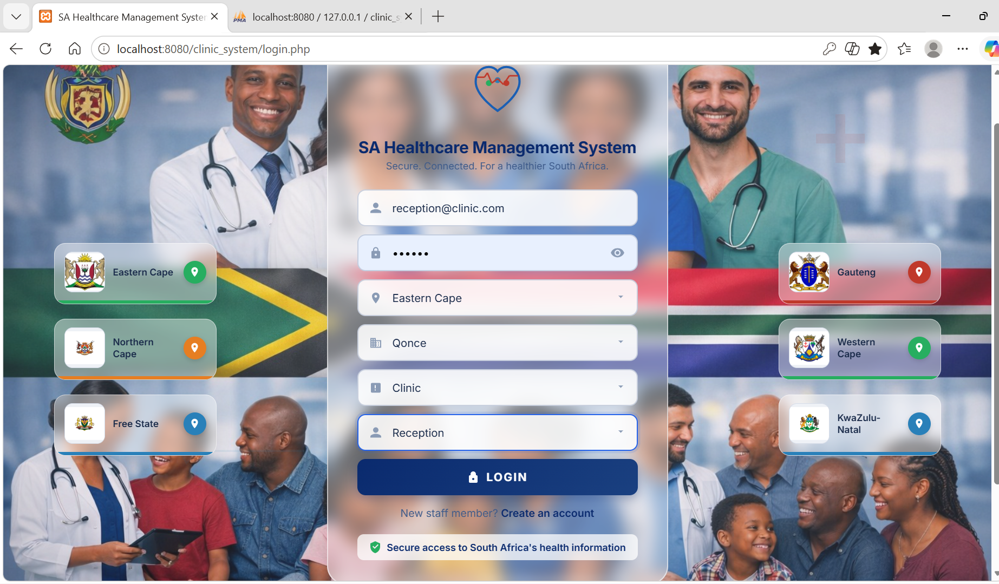
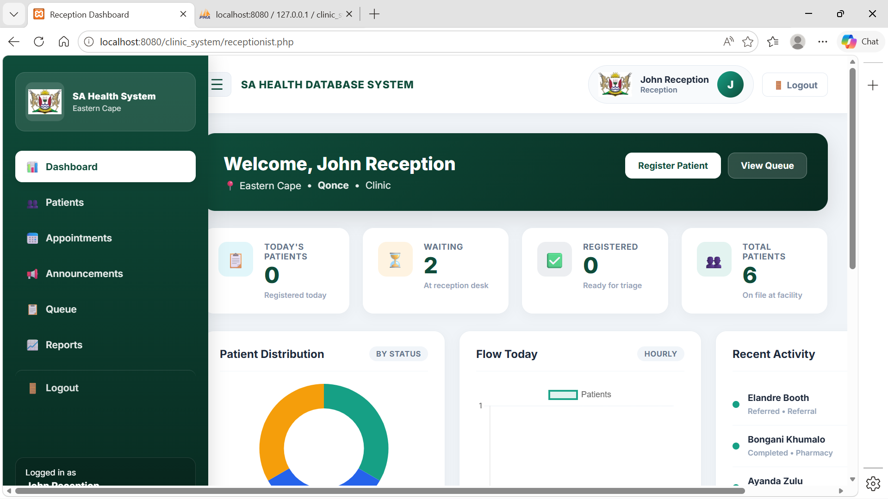
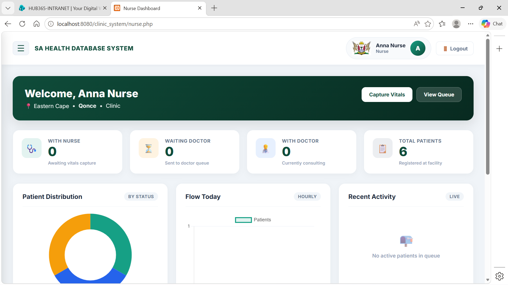
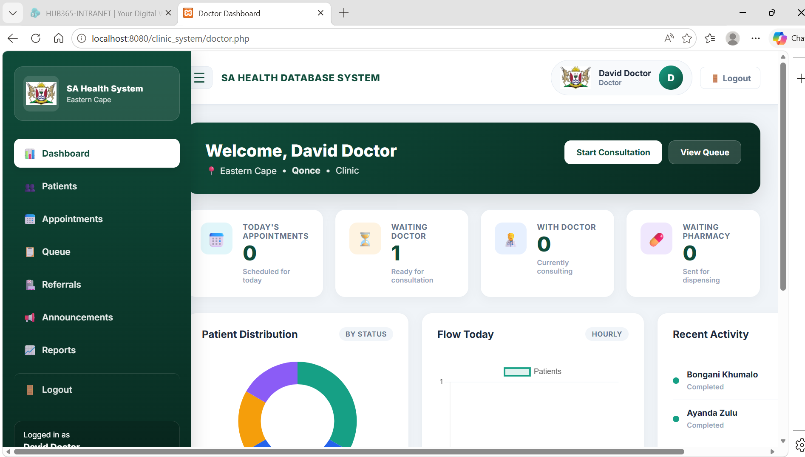
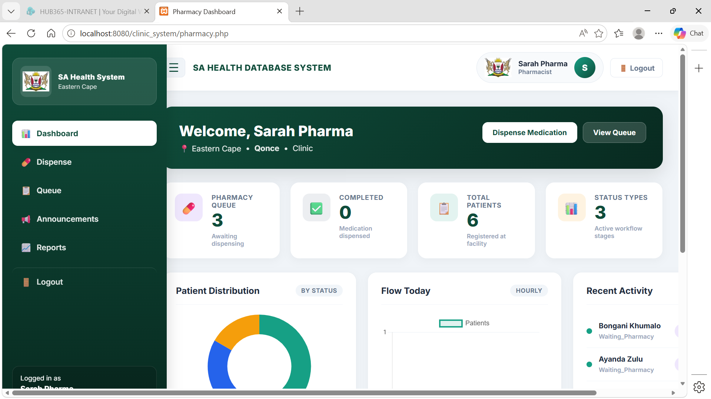
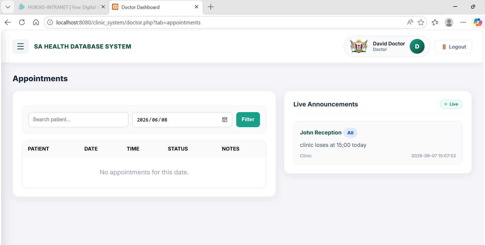

# SA Healthcare Management System

End-to-end healthcare workflow app for South African clinics — registration, triage, consultations, dispensing, and reporting. Built as a **portfolio project** to demonstrate full-stack PHP/MySQL development and real-world system design.

**Repository:** [github.com/Elandre840/SA-HealthCare-management-System](https://github.com/Elandre840/SA-HealthCare-management-System)

---

## Overview

A role-based web application that simulates clinic operations from patient arrival through medication dispensing. Staff work across **province → city → facility** locations with dashboards, queue visibility, announcements, emergency triage alerts, and reporting.

**Patient flow:** Reception → Nurse → Doctor → Pharmacist → Completed

---

## Case Study

### Problem
Clinic staff often work in silos — reception, nursing, doctors, and pharmacy each track patients differently. That makes queues hard to monitor, handoffs easy to miss, and reporting slow to produce across multiple sites.

### Solution
Built a single web platform where each role sees only what they need, scoped to their **province, city, and facility**. Patients move through a defined workflow with live queue visibility, internal announcements, and emergency triage alerts (MediAlert).

### Key challenges & how they were solved

| Challenge | Approach |
|-----------|----------|
| Multiple roles, one database | Unified `users` table with `account_type` and role-based routing after login |
| Multi-facility demo data | Facility-scoped queries and province-themed UI via `ui_theme.php` |
| Emergency escalation | Nurse/doctor triage triggers in-app announcements plus email/SMS logging pipeline |
| Readable dashboards | Chart.js reporting, KPI cards, and print-friendly report views |

### Skills demonstrated
PHP · MySQL · Session-based RBAC · REST-style form workflows · SQL schema design · HTML/CSS/JS · Chart.js · XAMPP local deployment

### Planned improvements
Prepared statements across all queries · bcrypt-only demo passwords · admin dashboard · CSRF protection · optional live demo deployment

---

## Features

| Area | Capabilities |
|------|----------------|
| **Reception** | Patient registration, appointments, queue, announcements, reports |
| **Nurse** | Vitals capture, triage notes, emergency alerts, handoff to doctor |
| **Doctor** | Consultation notes, diagnosis, prescriptions, referrals |
| **Pharmacist** | Prescription review, dispensing, workflow completion |
| **Multi-site** | Province-themed UI, facility-scoped data, demo data for EC, NC, and WC |
| **MediAlert** | Emergency triage notifications (email + logged SMS for demo) |

---

## Tech Stack

- **Backend:** PHP 8.x
- **Database:** MySQL / MariaDB
- **Frontend:** HTML, CSS, JavaScript
- **Charts:** Chart.js
- **Local server:** XAMPP (Apache + MySQL)

---

## Quick Start

1. Clone the repo into your XAMPP `htdocs` folder.
2. Import `clinic_system_demo_v2.sql` into MySQL.
3. Confirm database settings in `db.php` (defaults work for XAMPP).
4. Open `http://localhost/clinic_system/` or `http://localhost/clinic_system/login.php`.

Full step-by-step instructions: **[setup.md](setup.md)**

### Demo login (Eastern Cape — Qonce — Clinic)

| Role | Email | Password |
|------|-------|----------|
| Reception | `reception@clinic.com` | `123456` |
| Nurse | `nurse@clinic.com` | `123456` |
| Doctor | `doctor@clinic.com` | `123456` |
| Pharmacist | `pharma@clinic.com` | `123456` |

On login, select **Eastern Cape → Qonce → Clinic** and the matching role. Additional demo accounts for Northern Cape and Western Cape are listed in [setup.md](setup.md).

---

## Project Structure

```
clinic_system/
├── assets/
│   ├── backgrounds/     # UI backgrounds
│   ├── emblems/         # Province emblems
│   └── screenshots/     # Portfolio screenshots
├── views/               # Shared staff UI partials
├── login.php            # Entry point + role routing
├── index.php            # Redirects to login
├── register.php         # Staff registration
├── receptionist.php     # Reception dashboard
├── nurse.php            # Nurse workflow
├── doctor.php           # Doctor consultations
├── pharmacy.php         # Pharmacy dispensing
├── clinic_schema.php    # Shared data-access helpers
├── medi_alert.php       # Emergency notification helpers
├── ui_theme.php         # Province colour themes
├── db.php               # Database connection
├── clinic_system_demo_v2.sql
├── README.md
└── setup.md
```

---

## Screenshots

| Reception registration | Reception queue |
|------------------------|-----------------|
|  |  |

| Nurse workflow | Doctor consultation |
|----------------|---------------------|
|  |  |

| Pharmacy dispensing | Patient medical history |
|-----------------------|-------------------------|
|  |  |

More screenshots are available in `assets/screenshots/`.

---

## What This Project Demonstrates

- Full-stack CRUD and workflow state management
- Role-based access control with session handling
- Multi-tenant-style filtering (province / city / facility)
- SQL schema design with appointments, consultations, and unified users model
- UI theming and operational dashboards
- Simulated emergency alerting pipeline

---

## Notes

- **Portfolio / demo use only** — not intended for production healthcare without security hardening.
- Demo passwords are plain text by design for easy local testing.
- Do not commit real credentials or patient data.

---

## Author

**Elandre Booth**  
Software Developer | Systems Builder

If you are reviewing this project for collaboration, feedback, or opportunities, feel free to connect via GitHub.

---

## License

This project is shared for portfolio and educational purposes. Contact the author for other uses.
